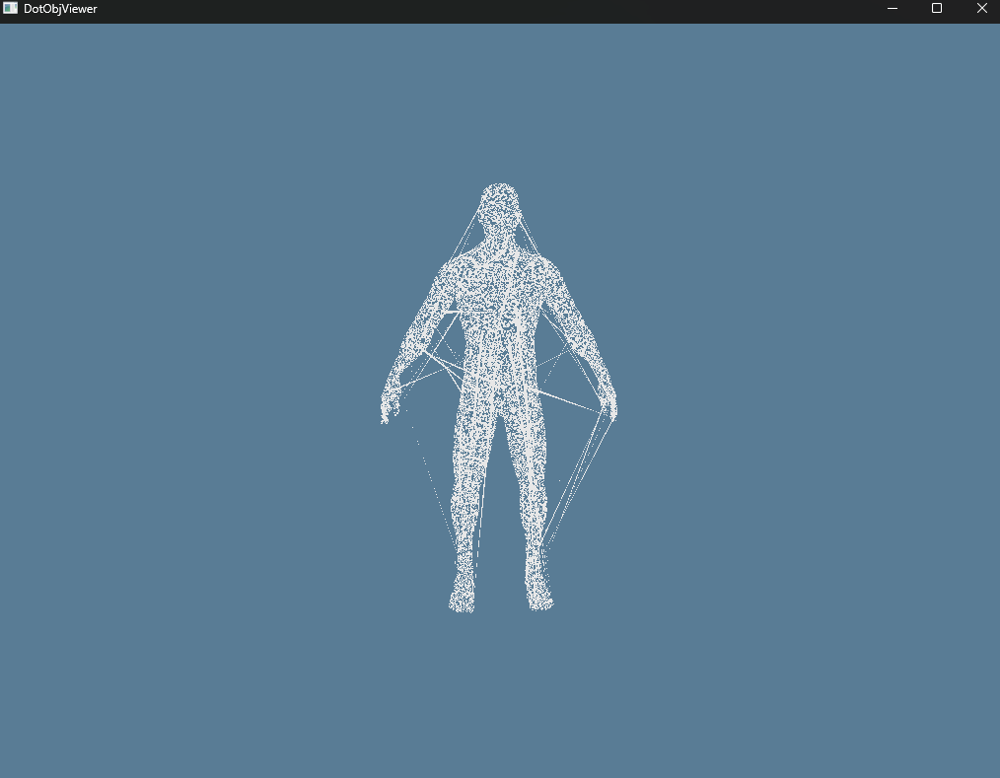

# DotObjViewer

DotObjViewer is a cross-platform 3D OBJ file viewer written in Rust, using wgpu for GPU rendering and winit for window management. The project aims to provide a simple, fast, and modern viewer for OBJ files on Windows, macOS, and Linux.

**Status:** Heavily Work In Progress And I'm not actively working on it due to other projects

---

## Features (Current)

- **Cross-platform**: Runs on Windows, macOS, and Linux (tested on Windows).
- **OBJ File Loading**: Import and display 3D models in the Wavefront OBJ format (using tobj).
- **Modern GPU Rendering**: Uses wgpu for fast, hardware-accelerated rendering.
- **Basic Camera Controls**:
  - Mouse drag to orbit around the model
  - Mouse wheel to zoom in/out
  - Auto-fit camera to loaded model
- **Keyboard Shortcuts**:
  - `Ctrl+O`: Open OBJ file dialog
  - `Ctrl+Q`: Quit application
- **Custom File Dialog**: Native file dialog for opening OBJ files
- **Simple UI**: Minimal window with a blue background and 3D model display
- **Logging**: Console logging for file loading, errors, and debug info

---

## Current State

Below is a screenshot of the current application rendering a loaded OBJ file:



---

## Building & Running


   ```sh
   cargo run
   ```
   or 
   ```sh
   cargo build && ./dotobjviewer
   ```

---

## Roadmap / Planned Features
- Improved camera controls (pan, reset, etc.)
- Fix my Monster White Addiction
- ~~Lighting and shading~~ Nevermind, Ref Issues 
- Support for OBJ materials (MTL)
- Wireframe/solid view toggle
- UI improvements (menus, status bar, etc.)
- Performance optimizations

---

## License
Take it apart as you wish, copyleft

---
