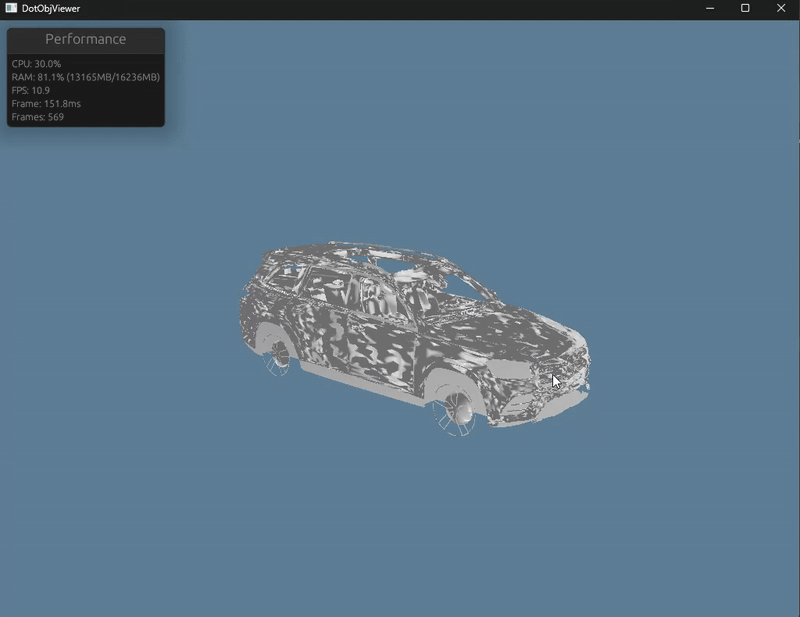

# DotObjViewer

---

## 🚀 Enhanced Graphics Features

- **Lighting:** Realistic ambient, diffuse, and specular lighting
- **Normals:** Per-vertex normals (auto-calculated if missing)
- **Depth Buffer:** Proper 3D rendering with hidden surface removal
- **Wireframe Mode:** Press `W` to toggle between solid and wireframe rendering
- **Camera:** Smooth orbit/zoom, auto-fit to model, and improved controls
- **Shaders:** Modern WGSL shaders for both solid and wireframe rendering
- **Test Model:** A cube OBJ (`test_cube.obj`) is included for demonstration

### Usage
- Press `O` to open and load an OBJ file (e.g., `test_cube.obj`)
- Press `W` to toggle wireframe mode
- Press `P` to toggle detailed performance stats
- Use the mouse to orbit and zoom
- Press `Q` to quit

### Performance Monitoring
The application includes real-time performance monitoring:
- **CPU Usage**: System-wide CPU utilization
- **Memory Usage**: RAM usage with total/used display
- **FPS**: Real-time frame rate monitoring
- **Frame Time**: Individual frame rendering time
- **Frame Count**: Total frames rendered

Performance stats are displayed in the console every 2 seconds. Press `P` to toggle between basic and detailed statistics.

---

DotObjViewer is a cross-platform 3D OBJ file viewer written in Rust, using wgpu for GPU rendering and winit for window management. The project provides a modern, feature-rich viewer for OBJ files with advanced graphics capabilities.

**Status:** Enhanced with advanced graphics features

---

## Features

- **Cross-platform**: Runs on Windows, macOS, and Linux (tested on Windows).
- **OBJ File Loading**: Import and display 3D models in the Wavefront OBJ format (using tobj).
- **Modern GPU Rendering**: Uses wgpu for fast, hardware-accelerated rendering.
- **Advanced Lighting System**:
  - Ambient, diffuse, and specular lighting
  - Configurable light position and intensity
  - Realistic material properties (shininess, reflectivity)
- **Depth Buffer**: Proper 3D depth testing for accurate rendering
- **Wireframe Mode**: Toggle between solid and wireframe rendering
- **Enhanced Camera Controls**:
  - Mouse drag to orbit around the model
  - Mouse wheel to zoom in/out
  - Auto-fit camera to loaded model
  - Smooth camera movement
- **Normal Calculation**: Automatic normal calculation for models without normals
- **Keyboard Shortcuts**:
  - `O`: Open OBJ file dialog
  - `W`: Toggle wireframe mode
  - `Q`: Quit application
- **Custom File Dialog**: Native file dialog for opening OBJ files
- **Enhanced UI**: Modern rendering with proper lighting and materials
- **Logging**: Console logging for file loading, errors, and debug info

---

## Graphics Features

### Lighting System
The viewer includes a comprehensive lighting system with:
- **Ambient Lighting**: Provides base illumination to prevent completely dark areas
- **Diffuse Lighting**: Simulates light scattering on rough surfaces
- **Specular Lighting**: Creates realistic highlights on shiny surfaces
- **Configurable Parameters**: Light position, color, intensity, and material properties

### Rendering Modes
- **Solid Mode**: Full lighting and shading with depth testing
- **Wireframe Mode**: Line-based rendering showing mesh structure
- **Automatic Normal Calculation**: Generates normals for models that don't include them

### Camera System
- **Orbit Controls**: Rotate around the model with mouse drag
- **Zoom Controls**: Mouse wheel for zooming in/out
- **Auto-fit**: Automatically positions camera to view entire model
- **Smooth Movement**: Responsive camera controls


## Current State

Below is a screenshot of the current application rendering a loaded OBJ file:



---

## Building & Running

```sh
cargo run
```
or 
```sh
cargo build && ./dotobjviewer
```

---

## Usage

1. **Load a Model**: Press `O` to open the file dialog and select an OBJ file
2. **Navigate**: Use mouse to orbit around the model, scroll wheel to zoom
3. **Toggle Wireframe**: Press `W` to switch between solid and wireframe rendering
4. **Toggle Performance Stats**: Press `P` to toggle detailed performance stats
5. **Quit**: Press `Q` to exit the application

---

## Technical Details

### Shaders
- **Main Shader** (`triangle.wgsl`): Implements Phong lighting model with ambient, diffuse, and specular components
- **Wireframe Shader** (`wireframe.wgsl`): Simple line rendering for wireframe mode

### Vertex Format
```rust
struct Vertex {
    position: [f32; 3],  // 3D position
    normal: [f32; 3],    // Surface normal
    color: [f32; 3],     // Vertex color
}
```

### Rendering Pipeline
- **Depth Buffer**: 32-bit float depth testing
- **Multiple Pipelines**: Separate pipelines for solid and wireframe rendering
- **Uniform Buffers**: Camera and lighting data passed to shaders
- **egui Overlay**: Real-time performance monitoring GUI

---

## Roadmap / Planned Features
- Support for OBJ materials (MTL)
- Multiple light sources
- Texture mapping
- Performance optimizations
- UI improvements (menus, status bar, etc.)
- Export functionality

---

## License
Take it apart as you wish, copyleft

---